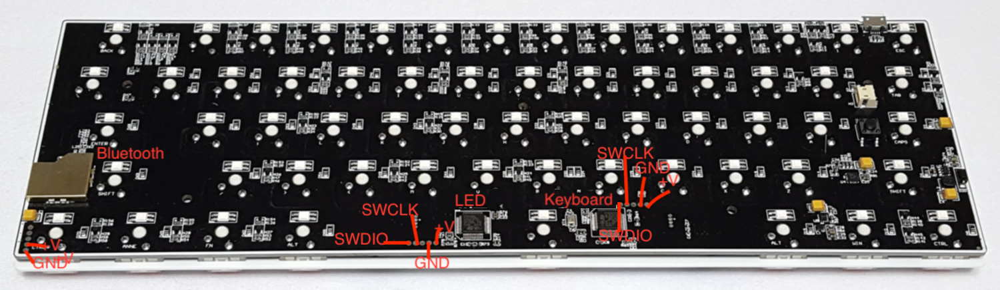

Hardware
========

The Anne Pro contains 3 MCUs to handle each of the Keyboard, LED and BLE operations:

- Keyboard: [STM32L151C8T6](http://www.st.com/en/microcontrollers/stm32l151-152.html)
- LED: STM32L151C8T6
- BLE: [TI CC2541](http://www.ti.com/product/CC2541)

The USB charging circuit is a [BQ24075](http://www.ti.com/product/BQ24075).

You can find some more information including pin assignments at https://github.com/hi-a/annepro-key

The [STM32L151 Reference Manual](http://www.st.com/content/ccc/resource/technical/document/reference_manual/cc/f9/93/b2/f0/82/42/57/CD00240193.pdf/files/CD00240193.pdf/jcr:content/translations/en.CD00240193.pdf) and [Data Sheet](http://www.st.com/content/ccc/resource/technical/document/datasheet/66/71/4b/23/94/c3/42/c8/CD00277537.pdf/files/CD00277537.pdf/jcr:content/translations/en.CD00277537.pdf) contain lots of useful information.

Flashing and debugging
----------------------

To develop it's best to directly flash via the debug pins instead of DFU, so you get full debugging support and even working stdout to your host machine.

Any ST-Link v2 programmer will do. You can find them cheap on ebay, or if you already have a STM32 Nucleo board you can use the programmer of that.

All the debug pins are exposed and easily accessible. Just solder on some wires and connect to your programmer:

OpenOCD
-------

Once your programmer is connected start `openocd -f anne.cfg`.
