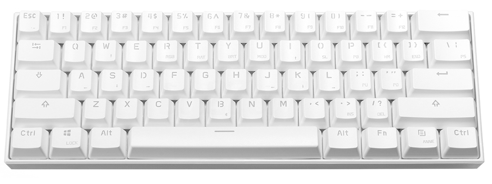

Hardware
========

The Anne Pro contains 3 MCUs to handle each of the Keyboard, LED and BLE operations:

- Keyboard (U2) and LED (U3): [STM32L151C8T6](http://www.st.com/en/microcontrollers/stm32l151-152.html)
- BLE: [TI CC2541](http://www.ti.com/product/CC2541)

The battery circuit is managed by
- Charging chip (U4): [BQ24075](http://www.ti.com/product/BQ24075)
  (marking `CDU`) or [BQ24073](http://www.ti.com/product/BQ24073)
  (marking `CKQ`)
- Voltage step-down converter (U5):
  [TPS62260](http://www.ti.com/product/TPS62260) (marking `BYK`)

You can find some more information including pin assignments at https://github.com/hi-a/annepro-key

The [STM32L151 Reference Manual](http://www.st.com/content/ccc/resource/technical/document/reference_manual/cc/f9/93/b2/f0/82/42/57/CD00240193.pdf/files/CD00240193.pdf/jcr:content/translations/en.CD00240193.pdf) and [Data Sheet](http://www.st.com/content/ccc/resource/technical/document/datasheet/66/71/4b/23/94/c3/42/c8/CD00277537.pdf/files/CD00277537.pdf/jcr:content/translations/en.CD00277537.pdf) contain lots of useful information.

Flashing and debugging
----------------------

To develop it's best to directly flash via the debug pins instead of
DFU, so you get full debugging support and even working semihosting
printing to your host machine.

Any ST-Link v2 or v2.1 programmer will do. You can find them cheap on
ebay, or if you already have an STM32 Discovery/Nucleo board you can
use the programmer built into that.

All the debug pins are exposed and easily accessible, however standard
jumpers are too high for the case. You can solder on some wires and connect to
your programmer:

The LED chip is the one closer to the edge. The pins order is the same
for both chips, counting from the BLE shield: SWDIO, SWCLK, GND, 3V3.

OpenOCD
-------

For the best experience, use a new opencd with a unified
`interface/stlink.cfg` (0.11, not yet released). Otherwise you will
need to specify the precise ST-Link version in `openocd.cfg`.  Once
your programmer is connected start with `make openocd`.

In another console, `make debug` will build a semihosting-enabled
binary and run `arm-none-eabi-gdb` over the openocd connection.

DFU
---

In DFU mode, the keyboard has STM's standard DFU USB identifiers
`0483:DF11`, with `obins DFU` as the product string.

PCB Revisions
----------

We have found two revisions, visible under the spacebar. On the switch
& case color sticker by Obins, the beginning of SN is approximately
your keyboard's manufacturing date.

0. V2.2: earlier revision, started at least 2016-12
 - Two sets of [solder points](images/solder-point.jpg) under spacebar
0. B31: possibly started 2017-06
 - No longer has those solder points

/u/columna1 contributed excellent photos of the PCB and chips for
V2.2:

- [PCB](images/pcb.jpg)
- [Battery connector](images/Pucent.jpg)
- [U4](images/U4.jpg)
- [U5](images/U5.jpg)

Keymatrix
---------

The keymatrix is connected to U2's GPIO pin groups A and B. There are
14 columns and 5 rows, giving 70 nodes. However 9 positions are not
usable, marked N/a in this table.

|        | A5       | A6   | A7  | B0  | B1  | B12   | B13 | B14 | A8  | A9  | A15 | B3  | B4   | B5        |
|--------|----------|------|-----|-----|-----|-------|-----|-----|-----|-----|-----|-----|------|-----------|
| **B9** | Escape   | 1    | 2   | 3   | 4   | 5     | 6   | 7   | 8   | 9   | 0   | -   | =    | Backspace |
| **B8** | Tab      | Q    | W   | E   | R   | T     | Y   | U   | I   | O   | P   | [   | ]    | \         |
| **B7** | Capslock | A    | S   | D   | F   | G     | H   | J   | K   | L   | ;   | '   | N/a  | Enter     |
| **B6** | Shift    | Z    | X   | C   | V   | B     | N   | M   | ,   | .   | /   | N/a | N/a  | Shift     |
| **A0** | Control  | Meta | Alt | N/a | N/a | Space | N/a | N/a | N/a | N/a | Alt | Fn  | ANNE | Control   |

LED matrix
---------

Bluetooth connection
----------

A keyboard's L0 and L1 addresses differ only in the first hex
digit. The OUI of the address can be TI, or unassigned.

Case
----

The PCB's screw positions are incompatible with most 60% cases.
